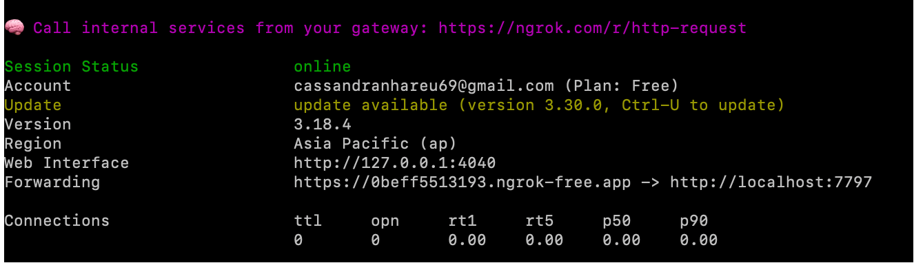

## 这是一个简单的额人脸识别项目

### 获取项目代码
~~~bash
git clone https://github.com/Gh811/fate_recognition.git
cd fate_recognition
~~~

### 获取项目依赖
~~~bash
pip install -r requirements.txt
~~~

### 运行项目
~~~bash
python app.py
~~~
运行后，访问http://127.0.0.1:7797/即可

## 跨局域网访问（使用 ngrok）
如果你希望在局域网以外访问本地 Flask 服务，可以使用 [ngrok](https://ngrok.com/) 暴露端口：

### 1. 安装 ngrok
- 到官网下载安装：https://ngrok.com/
- 注册账号，获取 `authtoken`。

### 2 启动 ngrok
~~~bash
ngrok http 7797
~~~


### 3. 再次启动本地服务
```bash
python app.py